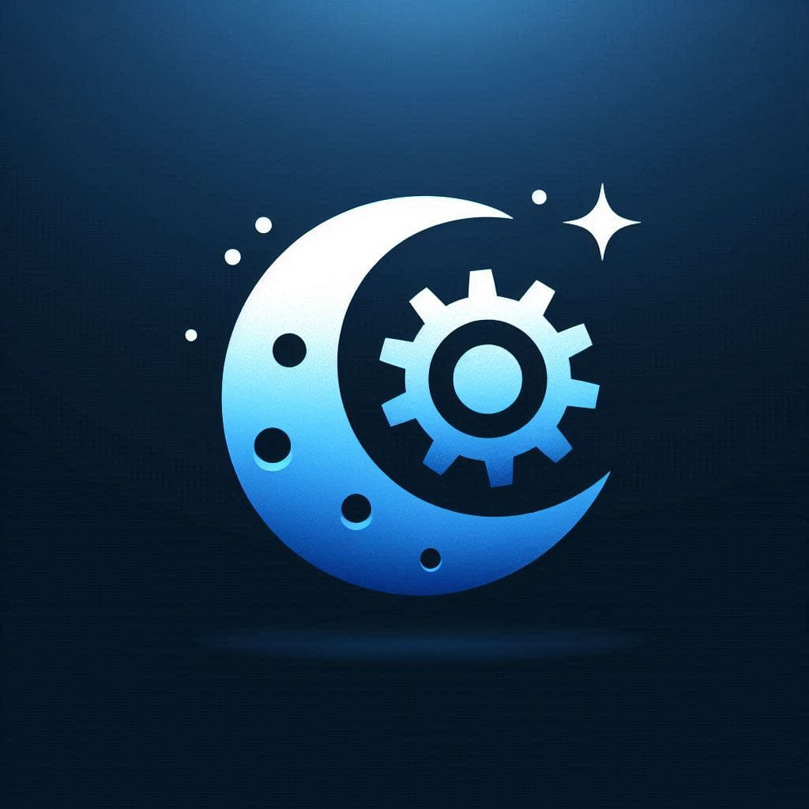

# ChatEPSEVG

ChatEPSEVG és un projecte desenvolupat amb l'objectiu de millorar la comunicació i el suport als diferents col·lectius de l'Escola Politècnica Superior d'Enginyeria de Vilanova i la Geltrú (EPSEVG). Aquest chatbot basat en intel·ligència artificial proporciona respostes precises i actualitzades a preguntes fàcils i recurrents, agilitzant els processos de comunicació i reduint la càrrega de treball del personal.

## Motivació
La principal motivació d'aquest projecte és optimitzar la interacció entre el personal docent i investigador (PDI), el personal d'administració i serveis (PAS) i l'estudiantat, millorant l'eficiència i la qualitat dels serveis de suport dins de la universitat.

### Beneficis per a cada col·lectiu

- **PDI:**
  - Accés ràpid a recursos acadèmics i administratius.
  - Resolució de dubtes sobre la gestió de cursos i materials docents.
  - Estalvi de temps en la resposta a preguntes repetitives.

- **PAS:**
  - Automatització de consultes administratives.
  - Millora en la gestió de cites i seguiment de processos.
  - Reducció de la càrrega en l'atenció al públic.

- **Estudiantat:**
  - Informació immediata sobre horaris, matrícula i serveis.
  - Resposta a dubtes acadèmics sense desplaçaments.
  - Accés a dades com el menú de la cafeteria.