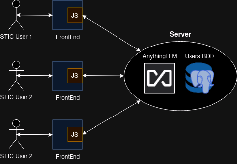

# ChatEPSEVG

ChatEPSEVG is a project developed with the aim of improving communication and support for the various groups within the Escola Politècnica Superior d'Enginyeria de Vilanova i la Geltrú (EPSEVG). This AI-based chatbot provides accurate and up-to-date answers to common and recurring questions, streamlining communication processes and reducing the workload for staff.

## Motivation
The main motivation behind this project is to optimize interaction between teaching and research staff (PDI), administrative and service staff (PAS), and students, enhancing the efficiency and quality of support services within the university.

### Benefits for Each Group

- **PDI:**
  - Quick access to academic and administrative resources.
  - Resolution of doubts regarding course and teaching material management.
  - Time savings in responding to repetitive questions.

- **PAS:**
  - Automation of administrative inquiries.
  - Improved management of appointments and process tracking.
  - Reduced workload in public service.

- **Students:**
  - Immediate information on schedules, enrollment, and services.
  - Academic doubts resolved without the need for physical visits.
  - Access to data such as the cafeteria menu.

